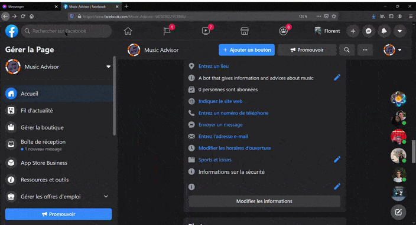

# 🎶 Music Advice Bot

(Chatbot & Recommender System final project)

Made by [Florent Drilhon](https://github.com/florentdrilhon) with ❤ and 😁

## Summary

- [🎯 Overview](#-overview)
- [👀 Demos](#-scenarii-review-and-demos)
- [🤖 Bot details](#-project-details)
   1. Used technologies
   2. Connection with Messenger
   3. Message extraction
   4. Conversation Management
   5. [Recommender system](#-recommender-system)

## 🎯 Overview

A bot to answer questions about music, but also with a recommender sytem to propose new musics for the user to like.

[Link to test the bot :](put the link here) 

The bot is a pretty simple NLP-based messenger bot that uses the spotify API to send the user basic information about tracks and artists. It also sends link from the Spotify platform to listen to items directly.

## 👀 Scenarii review and Demos:

##### Basic scenarii

The bot is able to detect Hello/Goodbye/Thanks/Presentation/ intents and answer it accordingly, and it also gives a suitable answer when it doesn't understand the intent or other things. 

##### 🎶 Tracks scernarii

Try asking "tell me about the song/track <trackName> and the bot will provide you basic informations about the asked track

Then it will ask you if you liked the track and trigger the recommendation scenario if yes. 

The scenario use an object from the recommender class, it gives it as argument the last track sent to the user, (kept in memory in the state property) and try to compute the recommendations to give back the user 3 tracks he may like.

video

##### 🎤 Artists Scenarii

Must precise the word "Singer/group/artist" for the bot to understant that the user does not asks for a track (NLP engine are not this accurate nowadays unfotunately).
The bot then sends informations about the artist and then asks if the user wants the artist best tracks or artists related artists

Can also give the user the artist who made an asked track and ask him if he like this track.

video

## 🤖 Bot details

##### 🛠 Used technologies

For the technologies, I decided to code the entire bot in python in order to facilitate the communication between the bot and the recommender system. As the messenger API expects a response from the webhook within 20 secs when receiving a message, and as a recommender system can take a little time to compute recommendations, gaining time was the key in building this project.

To launch the server to communicate with the webhook I used flask, a python framework that allow to implement simple endpoints to deal with http requests.

To create my recommender system, I used simple machine learning library Scikit-learn in order to cluster the data, and pandas and numpy to manipulate it.

More generally, I decided to follow an Oriented Object Programmation approach and designed classes to implement my functions.

##### 🌐 Connection with messenger

To connect my code with messenger, I set up a webhook, and all the functions that communicates with the webhook are detailed in the src.fbeamer.py file. In this file we can find function to verify the connection, but also to receive message, extract the main informations and send back a message to the webhook.

To send messages, I decided to implement different type of message sending : text, images, and custom templates for track and artist items.

To design the custom templates I used the generic templates of the messenger API, more information in the [documentation](https://developers.facebook.com/docs/messenger-platform/send-messages/template/generic/)

**Note:** I designed functions to send basic sender actions such as "typing" and "mark as seen" to make my bot more human-like but these actions are currently not available in EU because of confidentiality measure. But facebook is planning to make it available again in 2021 this is why I decided to keep them in my code. More info about this [here] (https://developers.facebook.com/docs/messenger-platform/europe-japan-updates?__cft__[0]=AZVf2VGEuUnRImO_IJvK1Hys-eLJd_gi8hi8g5EyZ6AyKU9VgGtYMI1W2DT7tuT-mBL7JOiOiSXAMGLEMtOgEAmCkhlOrOeMueu7VWNTRlqEf2frewDq-qRxx1Y-eCiChzw&__tn__=R]-R)

So if you test the code don't worry if there are some errors printed in the debug console, this is normal.

##### 📩 Message extraction

In order to detect intents and entities from a message, I connected my bot to the [wit.ai](https://wit.ai/) NLP engine. I connected it directly to the facebook app so the message received from the webhook contains an "NLP" part in which I can get the work of the engine.

To extract the intent and entities from this message, I detailed functions in the src.fbeamer.py file again.

##### 🎸Getting music information

To get the information needed in order to answer the user questions, I connected my code to the spotify API from which I can get a lot of different informations. To facilitate this connection I used the module Spotipy that simplifies the exchanges between python and the API

I detailed all the functions in src.spotifyAPI.py file, in which I designed a class that will handle all the connections with the API and extract the main informations from the object received.

From the functions available in the API, I focused on extracting the main informations about tracks and artists.

##### Conversation management

Once the message is received and handled, with the intents and entities extracted, I need to answer back the user with the right answer adapted to its needs.

I decided to create class conversationner in src.conversationner.py file that will define the bot responses and send it accordingly to the right situtation.

For that I designed functions to represent each scenario the bot can answer to, and I created a main function that will receive the decrypted message and launch the right scenario accordingly to the intent detected.

The conversationner class has a property "patterns" that is a dictionnary in which I precised different answer model for a given situation (as key in the dict).

##### 👍 Recommender system 

To recommend items to the user, as the user is not known by the system at first, I decided to use a collaborative filtering content-based recommender system. Also, as the chatbot is not connected to any database, it cannot keep information about the users, so it would have been not this pertinent to create a user-based recommender system.

I found a a Spotify dataset based on Tracks , so I was able to create clusters among those data. So when a user asks questions about a track, I get the related information and predict the cluster to which belongs this info and return the most similar items and send them back to the user.

The good point of finding a Spotify dataset is that it contains tracks Id that I can send directly to the API to get more information about a track.

To implement this recommender system, I first a research work detailed in the notebook and the README of the "recommender" folder. 

Then I kept the main functions and implemented them in the recommender.recommender.py file in which I created a recommender class.

